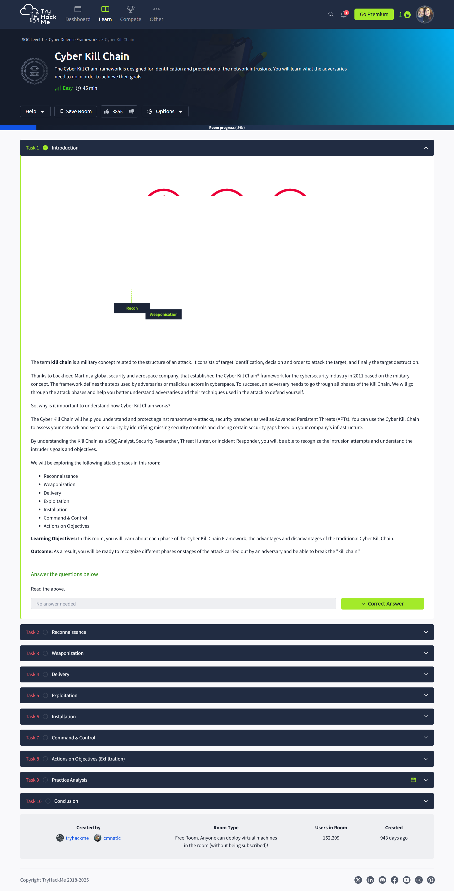
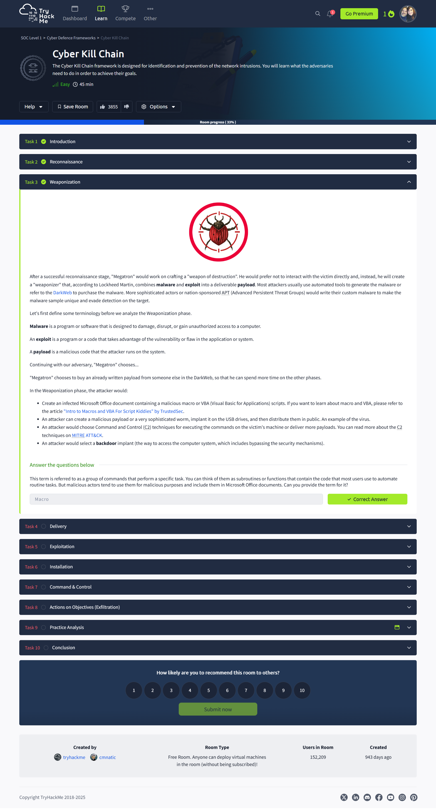
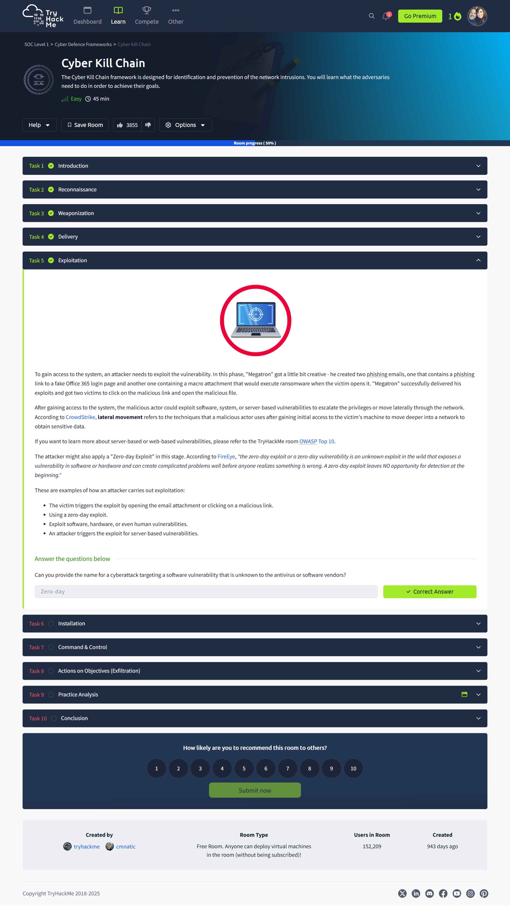
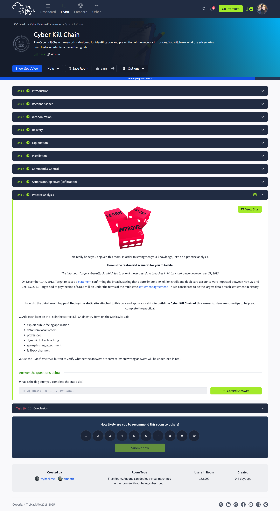

# 🔗 Cyber Kill Chain

> **TryHackMe: SOC Level 1 – Cyber Defence Frameworks**  
> Completed: April 11, 2025

## 🔍 Overview

This room breaks down the **Cyber Kill Chain** framework, created by Lockheed Martin, which models the stages of a cyberattack. It’s used by security analysts to understand and disrupt an adversary’s process—from reconnaissance to achieving objectives. Through guided tasks and a real-world practical, learners walk through each stage to grasp the attack lifecycle and corresponding defensive strategies.

## 💡 Key Takeaways

- Adversaries follow a repeatable structure to carry out intrusions.
- Disrupting early stages (e.g., reconnaissance or weaponization) reduces attack success.
- Each phase represents opportunities for defenders to identify and stop threats.
- Tools like MITRE ATT&CK help map TTPs and enhance detection strategies.

## 🧠 Kill Chain Stages Covered

1. **Reconnaissance** – Researching the victim using OSINT and email harvesting  
2. **Weaponization** – Crafting malicious payloads and exploits  
3. **Delivery** – Phishing, USB drops, watering hole attacks  
4. **Exploitation** – Triggering vulnerabilities, zero-days  
5. **Installation** – Establishing persistence via web shells or backdoors  
6. **Command & Control** – C2 communication like DNS tunneling  
7. **Actions on Objectives** – Exfiltration, lateral movement, and destruction  

## 🔧 Tools & Concepts Learned

- **OSINT Framework**  
- **Payload creation and macros**  
- **Watering hole and phishing techniques**  
- **Zero-day exploits**  
- **Persistence mechanisms (e.g., timestomping, web shells)**  
- **C2 Channels: DNS tunneling, beaconing**  
- **MITRE ATT&CK alignment**

## 📸 Screenshots

  
*Intro to the Cyber Kill Chain concept.*

  
*Collecting OSINT and email harvesting during recon.*

  
*Building a weaponized macro payload.*

  
*Executing the payload to exploit vulnerabilities.*

  
*Using timestomping and backdoors for persistence.*

  
*Command & control and reaching final attacker goals.*

  
*Static site activity replicating the infamous Target breach.*

.png)  
*Completion badge for the room.*

## ✍️ Reflection

This room solidified my understanding of adversary behavior from start to finish. Mapping each phase to real-world examples helped contextualize why SOCs need layered defenses. The static site practice was a great way to apply the framework to an actual breach scenario. I’ll definitely keep referencing the Kill Chain when thinking about detection strategies and blue teaming.

## 🔗 Related to Security+

- Domain 1.0: Threats, Attacks, and Vulnerabilities  
- Domain 4.0: Security Operations  
- Domain 5.0: Incident Response  
