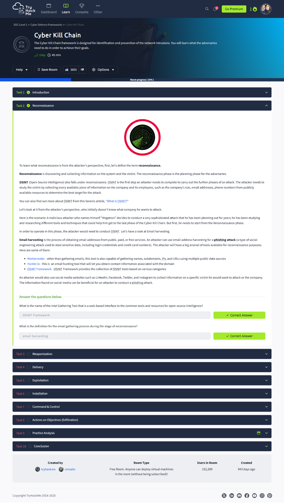
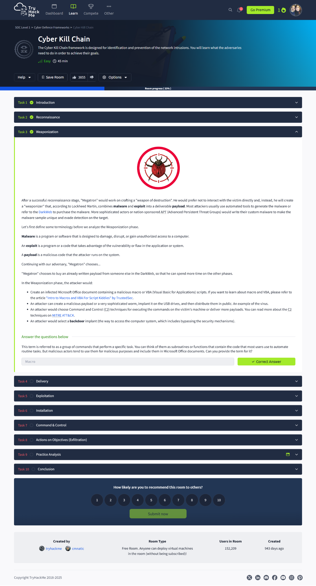
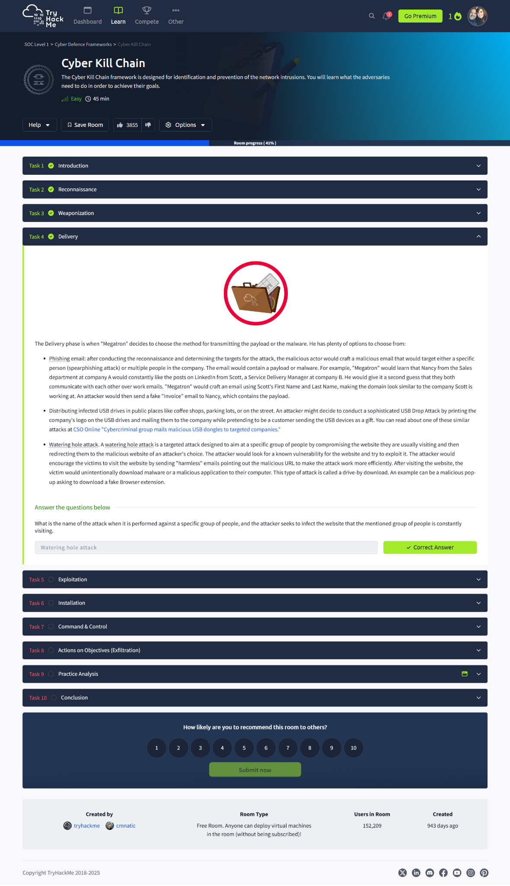
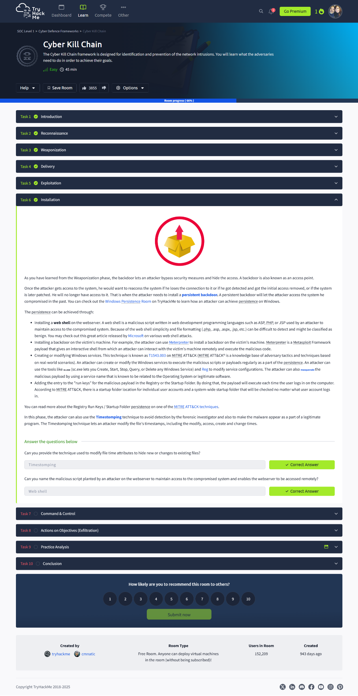
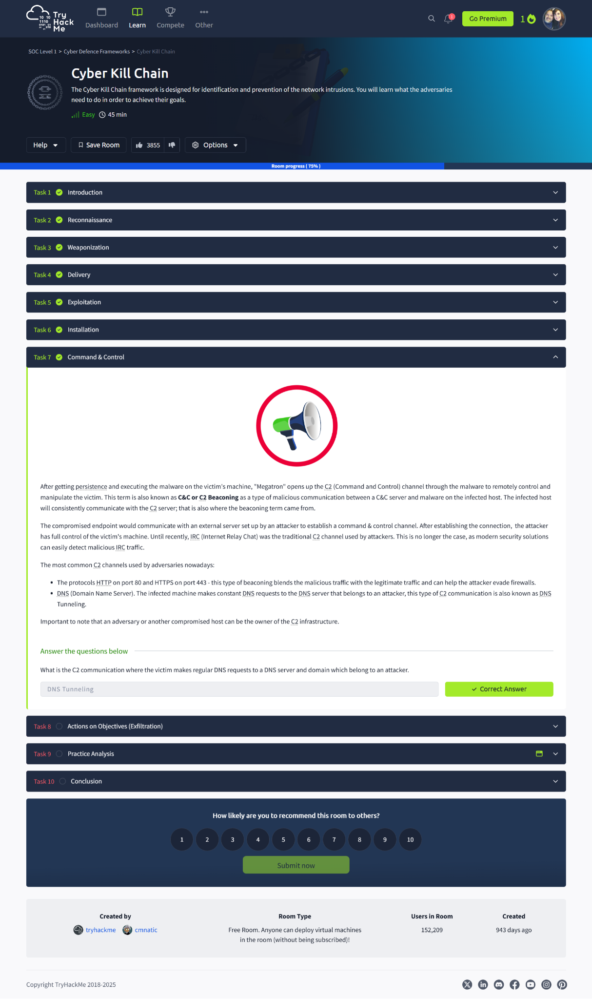
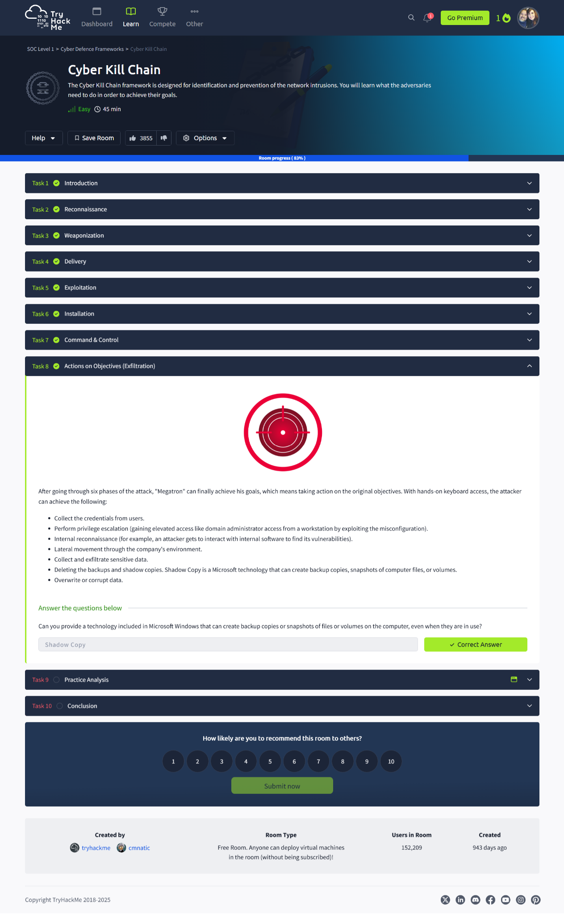
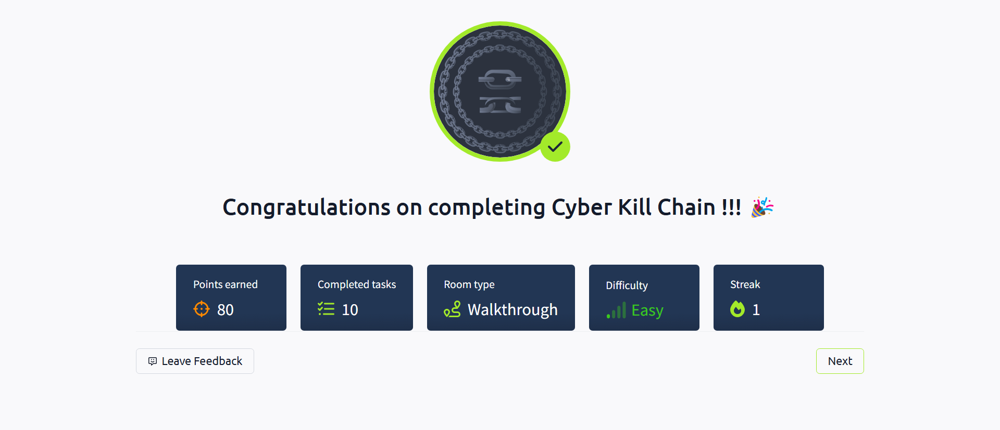

# 🔗 Cyber Kill Chain  
> **TryHackMe: SOC Level 1 – Cyber Defence Frameworks**  
> Completed: April 13, 2025

## 🔍 Overview  
This room explores the **Cyber Kill Chain**, a threat intelligence model developed by Lockheed Martin that breaks down the lifecycle of a cyberattack into seven distinct phases. It helps defenders identify where an attacker is within their operation and guides proactive strategies to detect, respond to, and prevent attacks before objectives are reached.

## 💡 Key Takeaways  
- Understanding each phase allows SOC teams to detect and disrupt attacks early.  
- Many real-world attacks follow this structured progression.  
- Real-world techniques like phishing, privilege escalation, and data exfiltration were mapped to each stage.  
- Detection is most effective when defenders can “break the chain” before attackers reach their final objective.

## 🔧 Tools / Models Learned  
- Cyber Kill Chain Framework  
- OSINT Reconnaissance  
- Payload creation and macro delivery  
- Exploitation and backdoor installation  
- C2 channels and beaconing  
- Exfiltration and destruction techniques  
- MITRE ATT&CK tactics applied in practice

## 📸 Screenshots  

  
*Overview of the Cyber Kill Chain framework and learning objectives.*

  
*Passive and active reconnaissance using OSINT and email harvesting.*

  
*Creating malicious macros and payloads.*

  
*Delivering malicious code via phishing or USB drops.*

  
*Triggering the vulnerability to gain unauthorized access.*

  
*Installing persistence mechanisms like web shells.*

  
*Establishing a communication channel between attacker and victim.*

  
*Executing final objectives such as data exfiltration and system tampering.*

  
*Real-world attack simulation based on the Target data breach.*

  
*Completion badge earned after completing all tasks.*

## ✍️ Reflection  
This room clarified how attackers move from information gathering to full system compromise and data theft. It was insightful to walk through each stage of the kill chain using realistic tools and techniques. Mapping them to real-world breaches emphasized the value of layered defense. I now have a stronger understanding of where detection efforts can be prioritized to break the chain early.

## 🔗 Related to Security+  
- **Domain 1.0:** Threats, Attacks, and Vulnerabilities  
- **Domain 4.0:** Security Operations  
- **Domain 5.0:** Incident Response