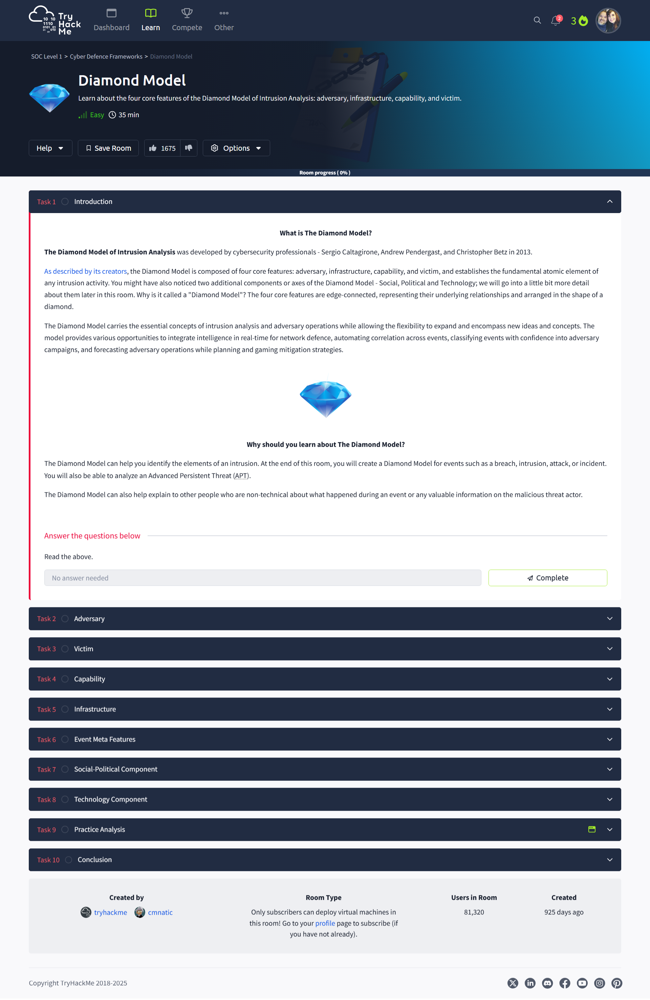
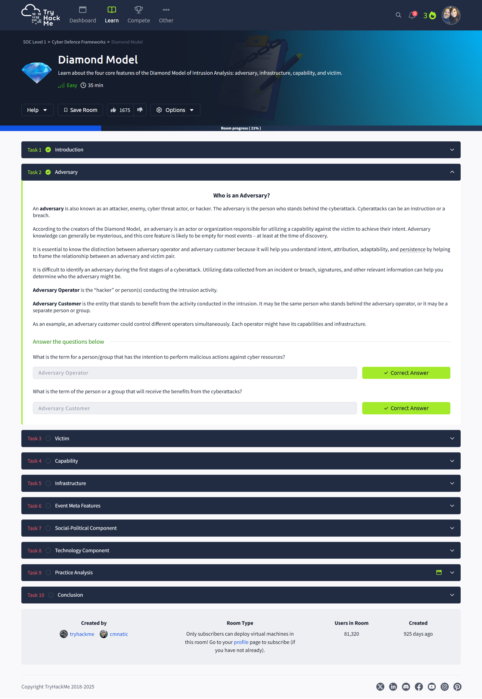
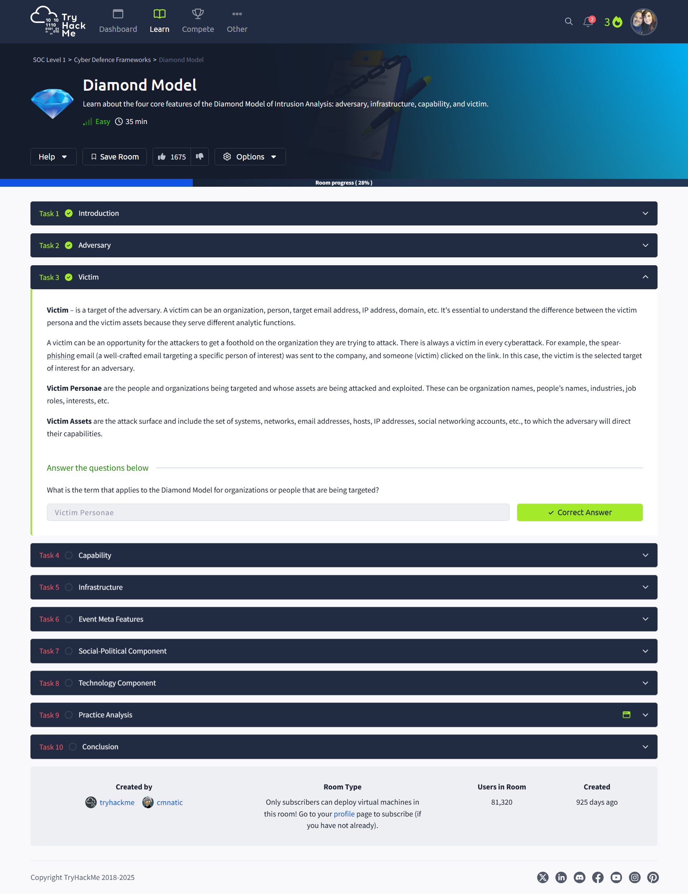
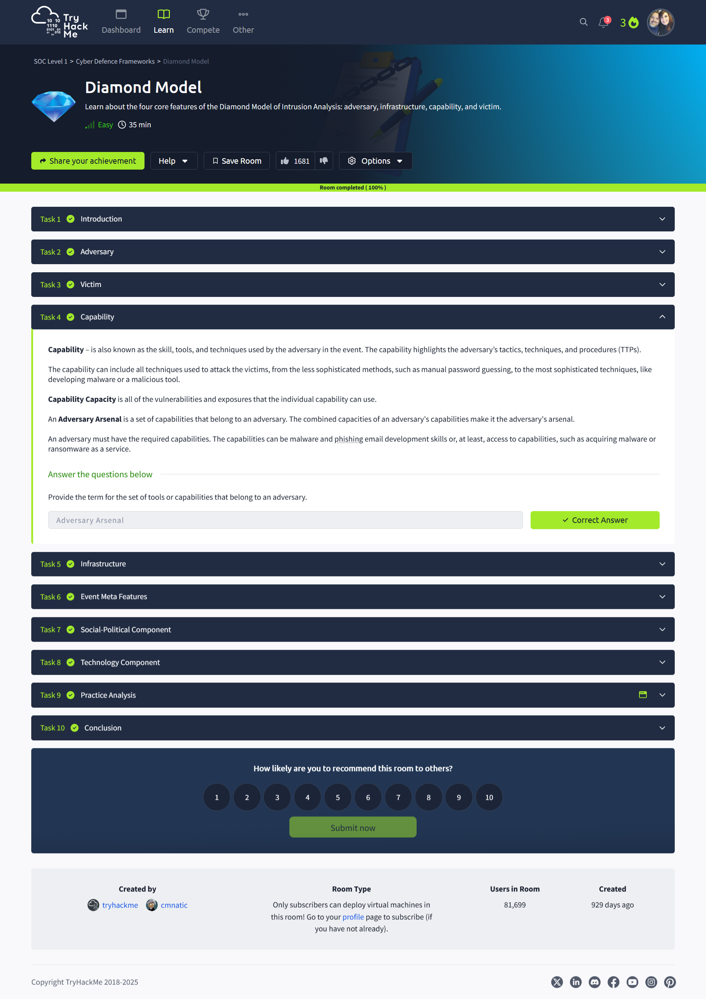
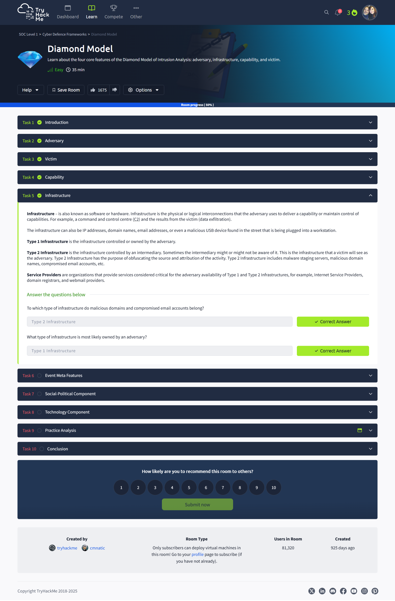
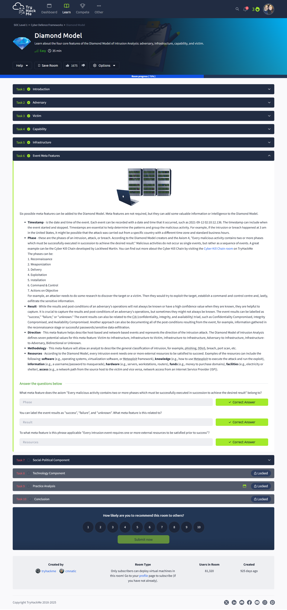
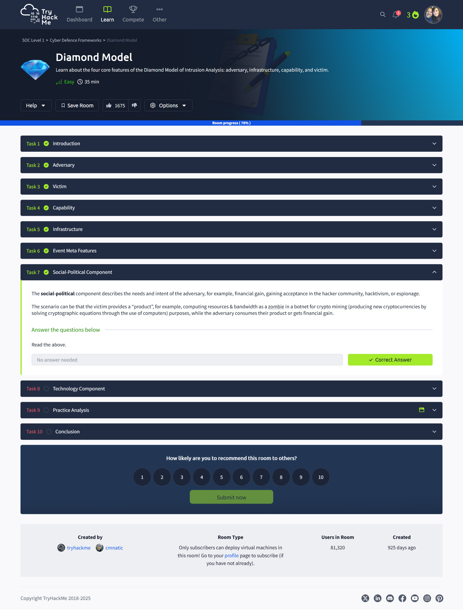
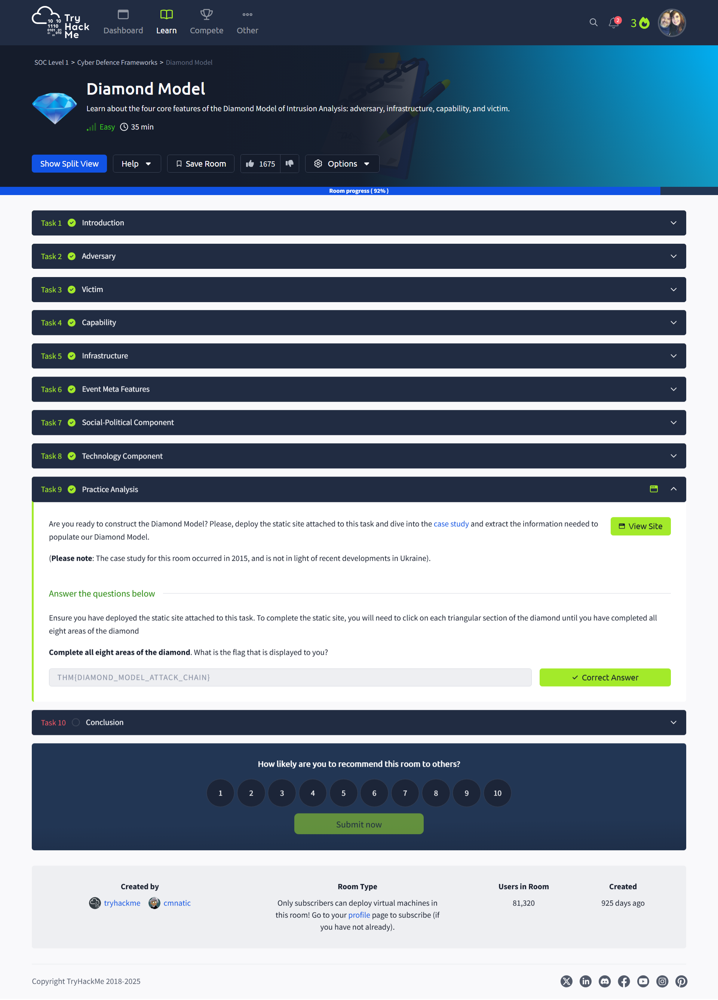
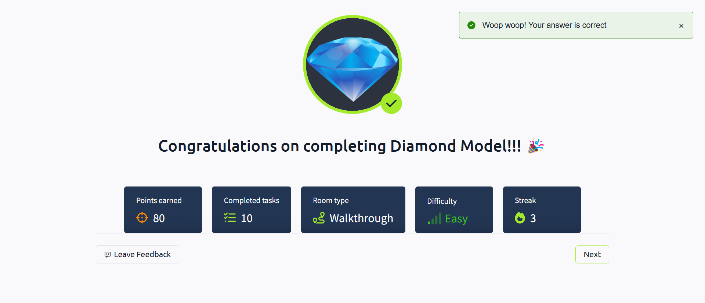

# 💎 Diamond Model of Intrusion Analysis – TryHackMe Walkthrough

**Platform:** TryHackMe  
**Room:** [Diamond Model](https://tryhackme.com/room/diamondmodel)  
**Learning Path:** SOC Level 1 – Cyber Defence Frameworks  
**Date Completed:** April 15, 2025  
**Difficulty:** Easy

---

## 📘 Overview

This room explores the **Diamond Model of Intrusion Analysis**, which consists of four core features: **Adversary**, **Victim**, **Infrastructure**, and **Capability**. This model helps analysts understand how attacks happen, who’s responsible, and which elements connect the attacker to the target. It’s especially useful for mapping out APTs and simplifying complex intrusions.

Additional axes like **Meta Features**, **Technology**, and **Social-Political Components** allow further context and threat intelligence enrichment.

---

## 🔍 Key Concepts

- Identify attacker intent and capabilities using Adversary-Target analysis
- Map infrastructure types (Type 1 and Type 2) and attacker capabilities
- Explore meta-features like timestamps, results, direction, and methodology
- Understand attacker motivations and technical means of execution

---

## 🧠 Skills Practiced

- Threat modeling
- Intrusion analysis
- Applying analytic frameworks
- Structured cyber incident documentation

---

## 📸 Screenshots

### 🧭 Overview and Introduction

### 🧑‍💻 Task 2 – Adversary

### 🧍 Task 3 – Victim

### 🧰 Task 4: Capability

### 🛠️ Task 5 – Infrastructure

### 🧬 Task 6 – Meta Features

### 🌍 Task 7 – Social-Political Component

### 🖥️ Task 8 – Technology Component

### 🧪 Task 9 – Practice Analysis

### 🎉 Completion Badge

---

✅ *This room deepens your understanding of how SOC teams analyze intrusions using structured models that support threat intelligence and attribution.*
