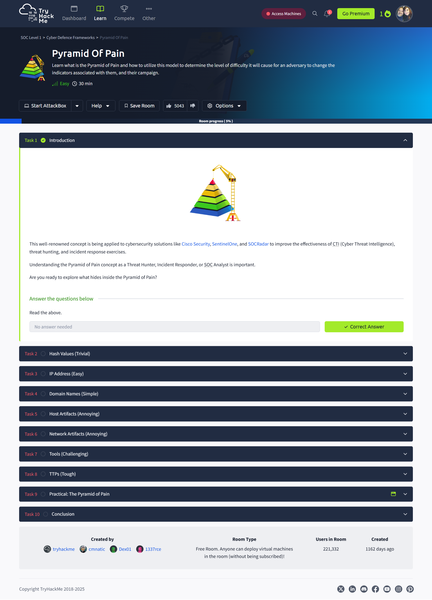
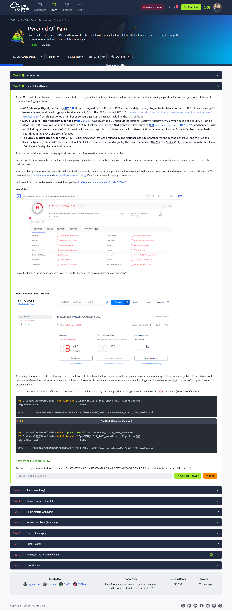
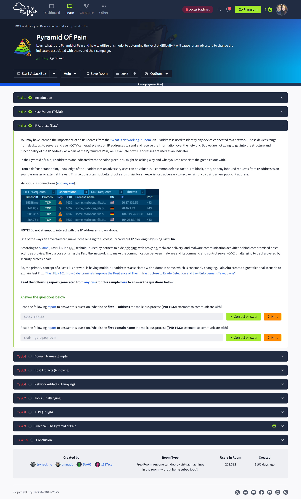
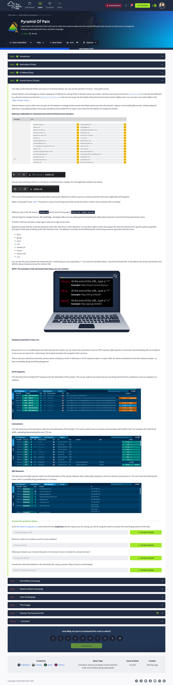
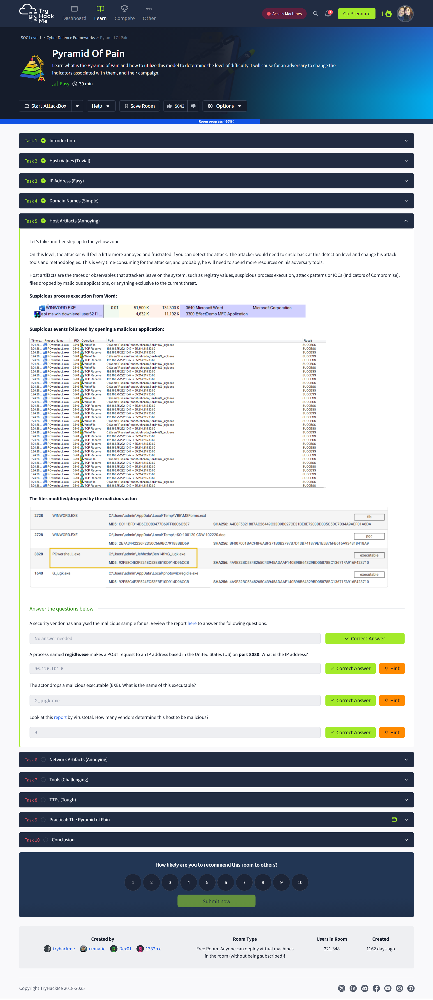
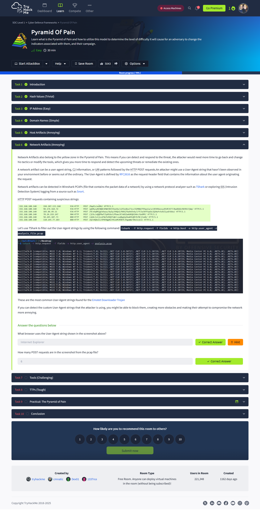
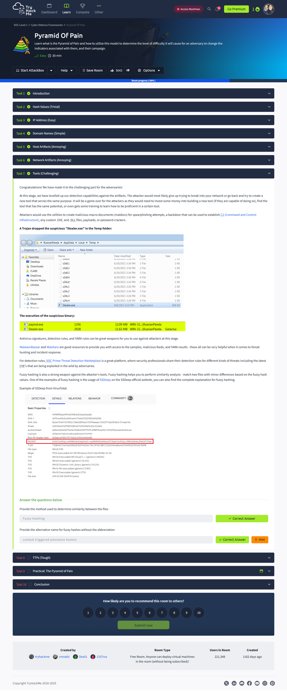
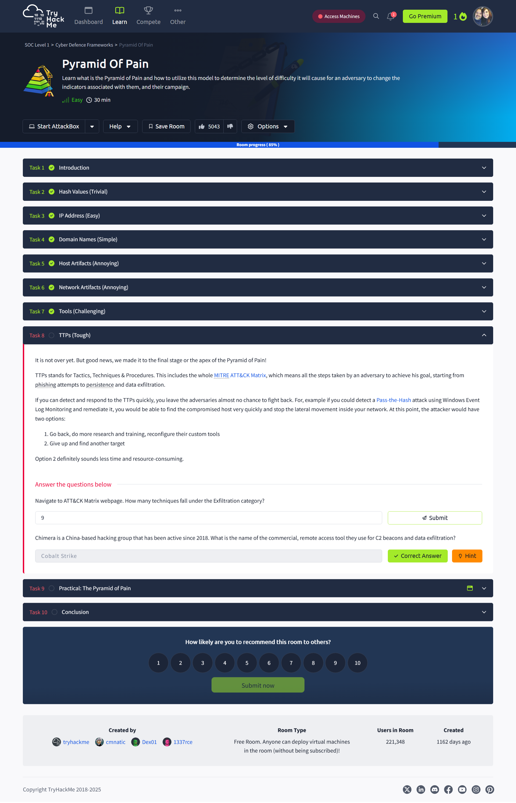
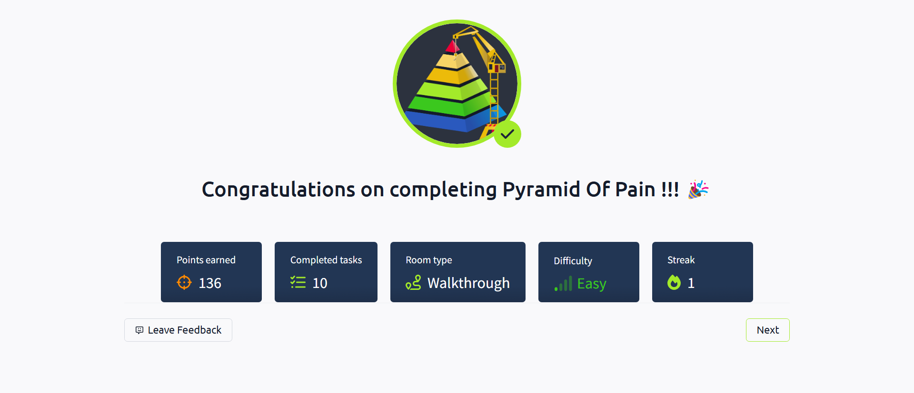
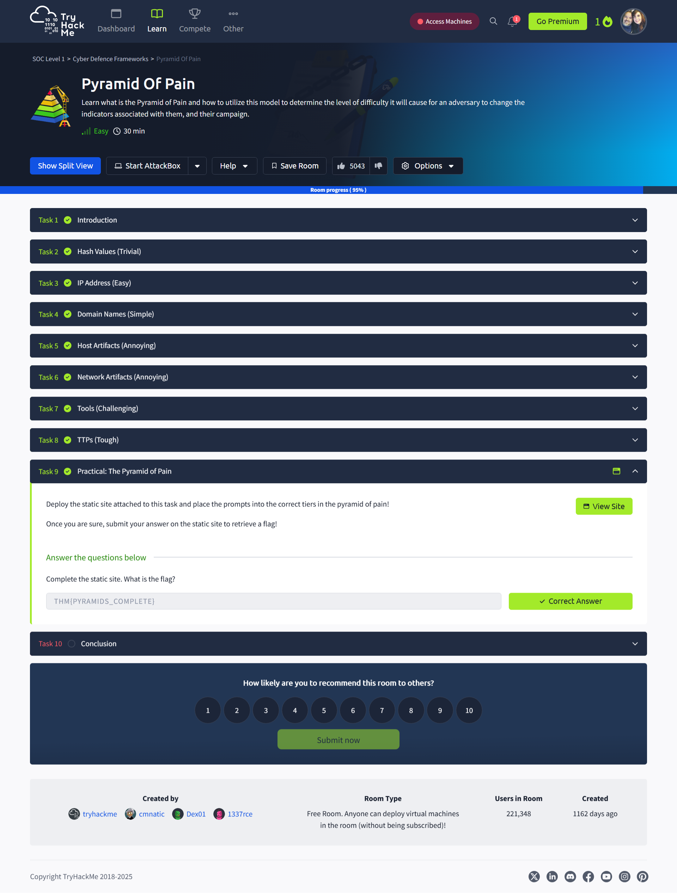

# 🎯 Pyramid of Pain  
> **TryHackMe: SOC Level 1 – Cyber Defence Frameworks**  
> Completed: April 11, 2025

## 🔍 Overview  
This room explores the **Pyramid of Pain** — a threat intelligence model that ranks indicators of compromise (IOCs) by how difficult they are for adversaries to replace. From file hashes to TTPs, the higher you go on the pyramid, the more impactful detection becomes. It teaches analysts how to effectively disrupt threat actors and improve defensive strategies.

## 💡 Key Takeaways  
- The most effective detections target tools, techniques, and procedures (TTPs), not just simple indicators like hashes or IPs.  
- Early detection using artifacts like domain names and malware file names gives defenders a valuable edge.  
- Understanding the Pyramid of Pain is essential for Tier 1–3 SOC roles and threat hunting workflows.  
- Analyzing fast-flux DNS, suspicious user agents, and sandbox behavior helps uncover evasive malware.

## 🔧 Tools / Models Learned  
- Pyramid of Pain threat model  
- VirusTotal & OPSWAT for hash analysis  
- Fast Flux DNS technique  
- HTTP & DNS artifact inspection  
- SSDEEP fuzzy hashing  
- MITRE ATT&CK Framework (focus on Exfiltration TTPs)  

## 📸 Screenshots  

  
*Introduction to the Pyramid of Pain model used by threat hunters and SOC teams.*

  
*Analyzing malicious file hashes using VirusTotal and OPSWAT.*

  
*Understanding how adversaries use Fast Flux to evade IP blocking.*

  
*Detecting malicious behavior via DNS and HTTP packet inspection.*

  
*Identifying dropped malicious executables and behavioral traces.*

  
*Analyzing custom User-Agent strings and POST traffic via TShark.*

  
*Comparing similar malware files with SSDEEP fuzzy hashing.*

  
*Mapping exfiltration techniques using the MITRE ATT&CK Matrix.*

  
*Badge earned after completing all room tasks.*

  
*Final drag-and-drop exercise showing mastery of the pyramid tiers.*

## ✍️ Reflection  
This room deepened my understanding of how defenders can proactively raise the cost for attackers. Rather than stopping at surface-level IOCs, I learned to think more like an analyst — focusing on behaviors, tools, and context that lead to stronger, more strategic defenses. By connecting theory with hands-on labs, this room reinforces the role of threat models in real-world SOC environments.

## 🔗 Related to Security+  
- **Domain 1.0:** Threats, Attacks, and Vulnerabilities  
- **Domain 4.0:** Security Operations  
- **Domain 2.0:** Architecture and Design (Defense in Depth)
