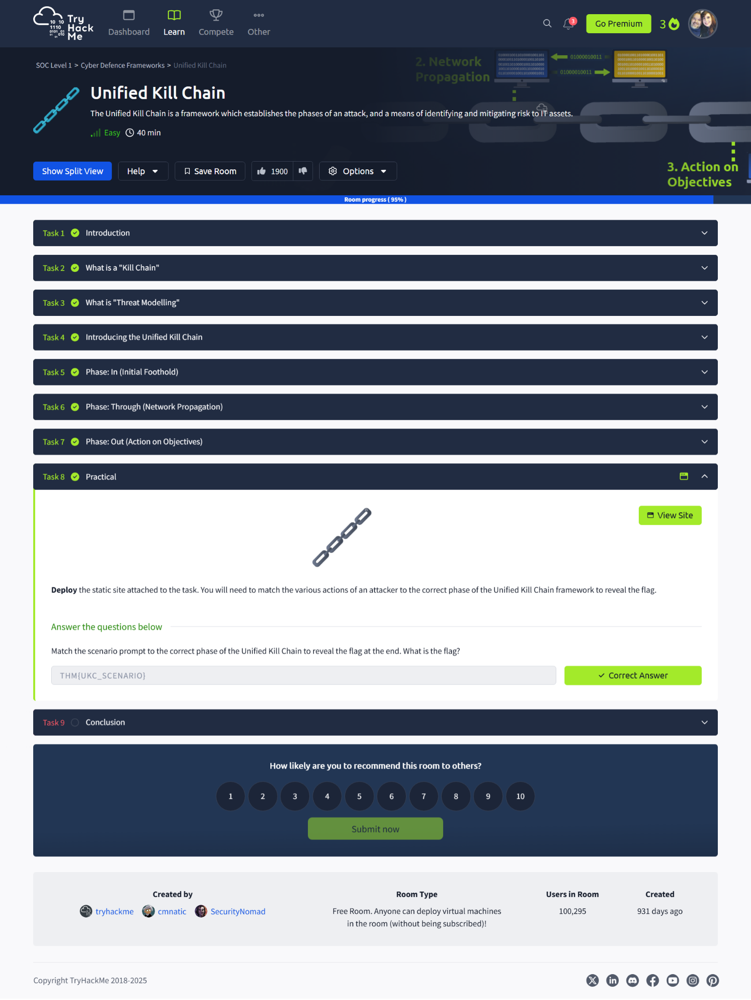

# 🔗 Unified Kill Chain

> **TryHackMe: SOC Level 1 – Cyber Defence Frameworks**  
> Completed: April 15, 2025

## 🔍 Overview  
The Unified Kill Chain (UKC) is a modern framework that extends traditional kill chain models by defining **18 detailed phases** of an attack. It combines insights from frameworks like Lockheed Martin’s Kill Chain and MITRE ATT&CK to provide a comprehensive, attacker-centric perspective on intrusion paths.

This room covers the UKC’s three main groupings:
- **In (Initial Foothold)**
- **Through (Network Propagation)**
- **Out (Action on Objectives)**

## 💡 Key Takeaways
- The UKC emphasizes **realistic attack paths** and shows how attackers move laterally or revisit earlier phases.
- It outlines **18 phases**, making it more detailed and useful for mapping and defending against threats.
- Understanding UKC supports **threat modeling**, helping SOC analysts assess risk and improve security posture.

## 🔧 Tools / Models Learned
- Unified Kill Chain (UKC)
- Threat Modeling
- MITRE ATT&CK Tactics (mapped to UKC phases)
- Principles of security related to the CIA triad

## 🧠 Core Phases and Concepts

**🔹 In (Initial Foothold):**
- **Reconnaissance (T0043):** Passive/active info gathering
- **Weaponization & Delivery:** Crafting payloads and delivering via phishing, USBs, etc.
- **Exploitation (T0022):** Gaining system access through vulnerabilities
- **Persistence (T0003):** Gaining long-term access (e.g., web shells)
- **Defense Evasion (T0005):** Avoiding detection
- **Command & Control (T0011):** C2 channels to control compromised hosts
- **Pivoting (T0008):** Using one system to target another

**🔹 Through (Network Propagation):**
- **Credential Access (T0006):** Harvesting usernames and passwords
- **Privilege Escalation (T0004):** Gaining admin-level access
- **Execution (T0002):** Running malware or scripts
- **Discovery (T0007):** Mapping internal assets
- **Lateral Movement (T0008):** Spreading across the network

**🔹 Out (Action on Objectives):**
- **Collection (T0009):** Gathering data of value
- **Exfiltration (T0010):** Sending stolen data out
- **Impact (T0044):** Tampering with integrity or availability (e.g., ransomware)
- **Objectives:** Fulfilling attacker goals (financial, political, etc.)

## 📸 Screenshots

  
*Introduction to the UKC framework and the 18 attack phases.*

  
*Gaining initial access through recon, exploitation, and establishing persistence.*

  
*Using the compromised system to pivot, escalate privileges, and discover targets.*

  
*Stealing data, disrupting systems, and fulfilling the attacker’s final objectives.*

  
*Steps to assess assets, identify risks, and apply security controls proactively.*

  
*Definition and origin of the kill chain model used in cybersecurity.*

  
*Task to match attacker actions to kill chain phases.*

  
*Successfully completed the TryHackMe UKC room.*

## ✍️ Reflection  
This room was a deep dive into how real-world attacks evolve beyond initial access. The level of detail in the UKC helped me understand the **why** behind attacker behavior, not just the how. Mapping UKC phases to MITRE tactics made each step actionable from a defense standpoint. It’s a framework I’ll definitely reference when conducting threat modeling and incident analysis.

## 🔗 Related to Security+
- **Domain 2.0**: Threats, Attacks, and Vulnerabilities  
- **Domain 4.0**: Security Operations  
- **Domain 5.0**: Incident Response